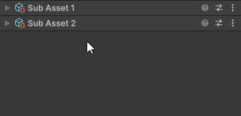

# UITK Editor Aid
This package contains UI Toolkit elements and utilities for custom Editor interfaces in Unity.

## How to install
See [Install a package from a Git URL](https://docs.unity3d.com/Manual/upm-ui-giturl.html) to install with
the Package Manager. The git URL for this package is `https://github.com/OscarAbraham/UITKEditorAid.git`.

You can also download this package into your Assets folder.

## Brief rundown of this package
Visit the package's API [documentation](https://artehacker.com/UITKEditorAid/api/ArteHacker.UITKEditorAid.html) for more information.
Click a name to go to the relevant documentation page for usage info and some code examples:

### [EditableLabel](https://artehacker.com/UITKEditorAid/api/ArteHacker.UITKEditorAid.EditableLabel.html)
A label that transforms into a field for editing its text. It becomes editable with a double click by default.

### [TabbedView](https://artehacker.com/UITKEditorAid/api/ArteHacker.UITKEditorAid.TabbedView.html)
A UI Toolkit element for organizing content with tabs. It has the option to support opening multiple tabs at
the same time by holding shift or ctrl (or cmd in macOS) while clicking a tab. It also supports remembering
the last opened tabs by assigning a unique string as a persistence key.

### [ArrayPropertyField](https://artehacker.com/UITKEditorAid/api/ArteHacker.UITKEditorAid.ArrayPropertyField.html)
A UITK control for a serialized Array or List. It has many customization options.

### [ListOfInspectors](https://artehacker.com/UITKEditorAid/api/ArteHacker.UITKEditorAid.ListOfInspectors.html)
A list of Objects similar to the components list in a GameObject's inspector.
This element is typically used with a list of subassets.

### [PropertyContainer](https://artehacker.com/UITKEditorAid/api/ArteHacker.UITKEditorAid.PropertyContainer.html)
Element that shows a SerializedProperty's prefab override indicators, and the property's context menu.
Currently, Unity only shows these things for some specific fields under specific circumstances. This
element makes those features available everywhere.
 
### [ManagedReferenceField](https://artehacker.com/UITKEditorAid/api/ArteHacker.UITKEditorAid.ManagedReferenceField.html)
Supports [SerializeReference](https://docs.unity3d.com/ScriptReference/SerializeReference.html) before 2022.2.
Unity 2022.2 adds support for Managed References in UITK, but this element can still be useful there to go
around some bugs (for example, UITK doesn't like when two classes contain fields with the same name but 
different type).

### [BindingStopper](https://artehacker.com/UITKEditorAid/api/ArteHacker.UITKEditorAid.BindingStopper.html)
Element that prevents binding its children from higher in the hierarchy. 
Use this element to keep fields bound to different Objects than the rest of the UI.

### [Disabler](https://artehacker.com/UITKEditorAid/api/ArteHacker.UITKEditorAid.Disabler.html)
Element that disables its content according to a callback. It's analogous to IMGUI's 
[DisabledScope](https://docs.unity3d.com/ScriptReference/EditorGUI.DisabledScope.html).

### [FixedSpace](https://artehacker.com/UITKEditorAid/api/ArteHacker.UITKEditorAid.FixedSpace.html) and [FlexibleSpace](https://artehacker.com/UITKEditorAid/api/ArteHacker.UITKEditorAid.FlexibleSpace.html)
Elements for quickly adding a space along their parent's flex direction. They're analogous to IMGUI's
[Space](https://docs.unity3d.com/ScriptReference/GUILayout.Space.html) and 
[FlexibleSpace](https://docs.unity3d.com/ScriptReference/GUILayout.FlexibleSpace.html).

### [DragAndClickManipulator](https://artehacker.com/UITKEditorAid/api/ArteHacker.UITKEditorAid.Manipulators.DragAndClickManipulator.html)
A Manipulator that handles treating a click as a drag when the mouse is dragged, and as a click when the mouse 
is clicked without moving it. It's useful for things that can be both clicked and dragged, like the headers of 
Components in the inspector.

### [SerializedObjectExtensions](https://artehacker.com/UITKEditorAid/api/ArteHacker.UITKEditorAid.Utils.SerializedObjectExtensions.html)
Extension methods for SerializedObject that are specially useful in combination with UI Toolkit.
It contains an IsEditable method that can be used in combination with the Disabler element to avoid editing 
objects that shouldn't be edited

### [UIToolkitExtensions](https://artehacker.com/UITKEditorAid/api/ArteHacker.UITKEditorAid.Utils.UIToolkitExtensions.html)
Contains many extension methods for VisualElements. It has methods to manipulate only the direct children of 
an Element, some other methods for quickly setting multiple style properties in one go, and a method for 
getting the SerializedProperty that is bound to a field, among other things.

## IMPORTANT: Embedding this package
If you are going to include this package inside another package or Asset Store plugin, please follow 
[these steps](https://artehacker.com/UITKEditorAid/manual_pages/embedding_this_package.html) to avoid collisions in projects that use this package 
by themselves.